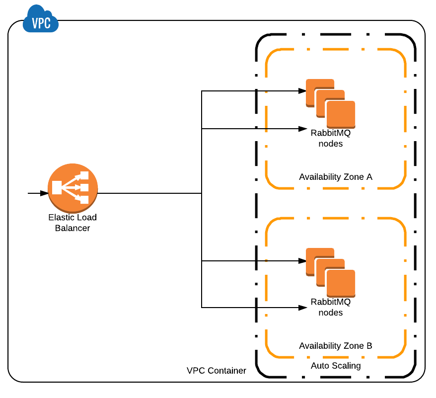

# Dead simple Terraform configuration for creating RabbitMQ cluster on AWS.


## What it does ?

1. Creates `${var.count}` nodes in `${var.subnet_ids}` subnets
1. Creates Autoscaling Group and ELB to load balance nodes
1. Makes sure nodes can talk to each other and create cluster
1. Make sure new nodes always join the cluster
1. Configures `/` vhost queues in High Available (Mirrored) mode with automatic synchronization (`"ha-mode":"all", "ha-sync-mode":"3"`)


<p align="center">

</p>


## How to use it ?

Clone the repo, go to `example` directory, create `terraform.tfvars` file with content:
```
region = "<REGION-HERE>"
access_key = "<YOUR-KEY-HERE>"
secret_key = "<YOUR-SECRET-HERE>"
ssh_key_name = "<SSH-KEY-NAME>"
vpc_id = "<VPC-ID>"
subnet_ids = ["<SUBNET-ID-1>", "<SUBNET-ID-2>"]
ssh_security_group_ids = []
elb_security_group_ids = []

rabbitmq_admin_password = "example-password"
rabbitmq_admin_password = "example-password"
rabbitmq_secret_cookie = "example-secret-cookie"
rabbitmq_node_count = 3
```

then run `terraform get`, `terraform plan` and `terraform apply`.

Are 3 node not enough ? Update `count` to `5` and run `terraform apply` again,
it will update Autoscaling Group and add `2` nodes more. Dead simple.

Node becomes unresponsive ? Autoscaling group and ELB Health Checks will automatically replace it with new one, without data loss.
