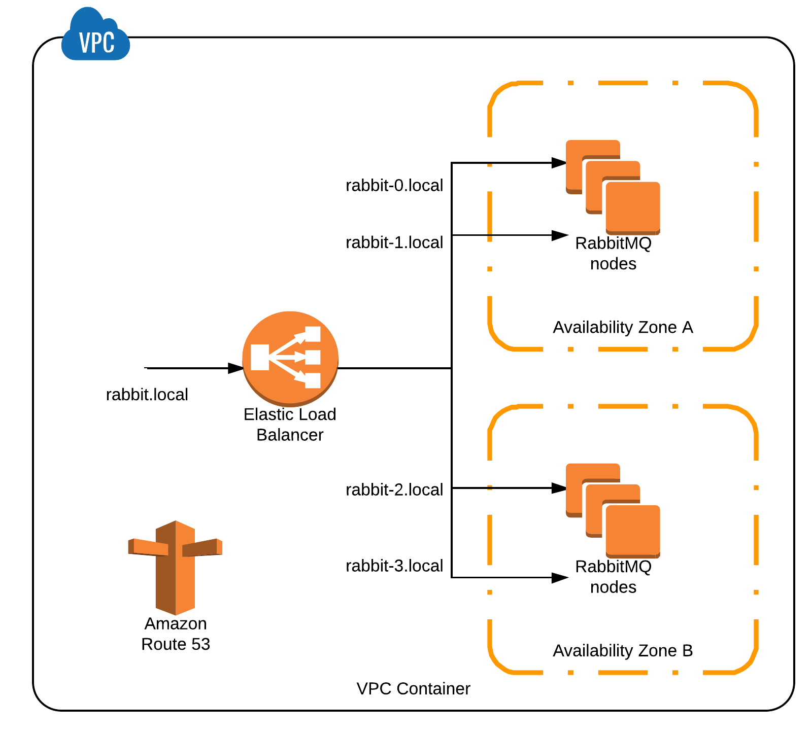

# Dead simple Terraform configuration for creating RabbitMQ cluster on AWS.


## Requirements
1. AWS account
2. Route53 Zone (internal preferably)

## How to use it ?

Create `terraform.tfvars` file with content:
```
region = "<REGION-HERE>"
access_key = "<YOUR-KEY-HERE>"
secret_key = "<YOUR-SECRET-HERE>"
ssh_key_name = "<SSH-KEY-NAME>"
vpc_id = "<VPC-ID>"
subnet_ids = ["<SUBNET-1-ID>", "<SUBNET-2-ID>"]
route53_zone_id = "<ROUTE53-ZONE-ID>"
```

then run `terraform plan` and `terraform apply`

## What it does ?

1. Creates `${var.count}` nodes in `${var.subnet_ids}` subnets
1. Adds Route53 A record for each node in `${var.route53_zone_id}` zone (like `rabbit-0.local`, `rabbit-1.local`, ...)
1. Makes sure they can talk to each other and create cluster
1. Configures `/` vhost queues in High Available (Mirrored) mode with automatic synchronization (`"ha-mode":"all", "ha-sync-mode":"automatic"`)
1. Creates ELB to load balance nodes and Route53 record for it (like `rabbit.local`)


<p align="center">

</p>
